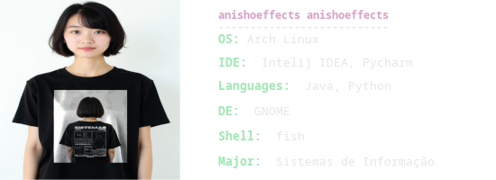

# 👋 Olá, eu sou o Edgar Henrique  
---
🎓 Estudante de **Sistemas de Informação** na UFPB  
💻 Apaixonado por **desenvolvimento backend** e **Linux**  
🎨 Curto trabalhar com **design gráfico** (GIMP) e **edição de vídeos** (After Effects)  

## 🌱 Atualmente aprendendo  
- ☕ **Java** (com foco em **Spring Boot** e **Javalin**)  
- 🌐 **HTML & CSS** para web  
- 🐧 **Customização no Linux** e ferramentas open source  
- 🎬 **Edição criativa** com GIMP e After Effects

## 🚀 Tecnologias e Ferramentas  

 
  
  
  
  
  
  
  
  
  
  

  

## 📌 Sobre mim  
Sou curioso e gosto de unir a lógica da programação com a criatividade do design.  
Entre linhas de código, customizações no Linux e experimentos em design e edição de vídeo, estou sempre em busca de aprender algo novo e transformar ideias em projetos.  

## 📷 Redes Sociais  

✨ Confira minhas edições no Instagram:  
  

🙋‍♂️ Meu Instagram pessoal:  

## 📊 Stats

    
  

